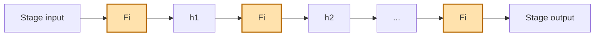
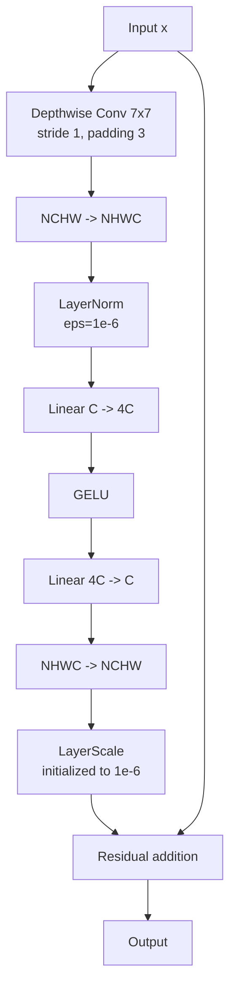
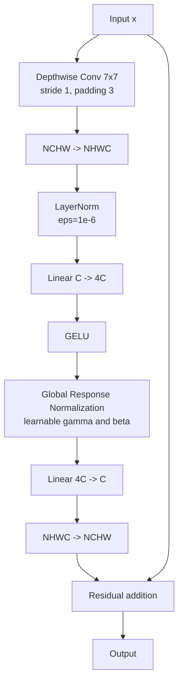

# Four-Stage Recurrent ConvNeXt Architecture

This document describes the array-configured ConvNeXt V1/V2 implementation in `recurrent_cnn.py` and its relationship to the native Tiny architectures.

## Architecture Interface

The block generation is selected by `V`, and stage structure is controlled by two four-element arrays:

```text
V=1 or V=2
ARR1=d1,d2,d3,d4
ARR2=r1,r2,r3,r4
```

- `V=1` uses the torchvision ConvNeXt V1 block with LayerScale.
- `V=2` uses the official ConvNeXt V2 block with Global Response Normalization (GRN) and no LayerScale.
- `ARR1[i]` is the number of distinct CNBlocks in stage `i + 1`.
- `ARR2[i]` is the number of times the complete stage is applied with shared parameters.
- The fixed stage widths are `[96, 192, 384, 768]`.
- For a 224 x 224 input, the stage resolutions are `[56, 28, 14, 7]`.

For example, `ARR1[0]=3` and `ARR2[0]=12` creates three distinct 96-channel blocks and applies that same three-block sequence twelve times. The three blocks do not share parameters with one another; the complete sequence shares parameters across its twelve executions.

Enabled stages must form a contiguous prefix. A disabled stage must have both depth and repeats set to zero, and every later stage must also be disabled.

## End-to-End Structure

```mermaid
flowchart LR
    I["Input<br/>B x 3 x 224 x 224"]
    S["Stem<br/>Conv 4x4/s4 + LN2d<br/>B x 96 x 56 x 56"]
    A["Stage 1<br/>d1 distinct C96 blocks<br/>complete stage repeated r1 times"]
    D1["LN2d + Conv 2x2/s2<br/>96 -> 192"]
    B["Stage 2<br/>d2 distinct C192 blocks<br/>complete stage repeated r2 times"]
    D2["LN2d + Conv 2x2/s2<br/>192 -> 384"]
    C["Stage 3<br/>d3 distinct C384 blocks<br/>complete stage repeated r3 times"]
    D3["LN2d + Conv 2x2/s2<br/>384 -> 768"]
    D["Stage 4<br/>d4 distinct C768 blocks<br/>complete stage repeated r4 times"]
    H["Adaptive average pool<br/>LayerNorm(last width)<br/>Linear -> 1000"]

    I --> S --> A
    A --> D1 --> B
    B --> D2 --> C
    C --> D3 --> D
    D --> H
```



Only transitions between enabled adjacent stages are constructed. If Stage 4 is disabled, the `384 -> 768` transition is absent and the classifier consumes the 384-channel Stage 3 output. The classifier width is always the width of the last enabled stage.

## Repeated Stage

For stage `i`, define a sequence containing `di` different blocks:

```text
Fi = Block_i,di o ... o Block_i,2 o Block_i,1
```

The stage recurrence is:

```text
h_i,1  = Fi(h_i,0)
h_i,2  = Fi(h_i,1)
...
h_i,ri = Fi(h_i,ri-1)
```

All calls to `Fi` use the same parameters. A downsampling operation is applied once after the final recurrence and is never part of the recurrent loop.



Every orange node is an invocation of the same stage module.

## Block Definitions

With `V=1`, every stage uses torchvision's CNBlock at its stage width:



Stochastic depth is fixed at `0.0` for every block. Consequently, the native array configuration matches ConvNeXt-Tiny topology, shapes, and parameter count, but not torchvision's default 0-to-0.1 stochastic-depth schedule.

With `V=2`, the block follows the official ConvNeXt V2 implementation:



GRN computes an L2 response over the spatial dimensions, normalizes it across channels, and applies a learnable residual modulation. Its `gamma` and `beta` are initialized to zero. ConvNeXt V2 removes the V1 LayerScale parameter. Stochastic depth remains fixed at `0.0` in this experiment for both versions.

## Preset Equivalents

| Former configuration | ARR1 | ARR2 | Last width | Unique blocks | Block applications |
|---|---|---|---:|---:|---:|
| Native ConvNeXt-Tiny | `3,3,9,3` | `1,1,1,1` | 768 | 18 | 18 |
| Promini | `1,1,1,0` | `12,12,12,0` | 384 | 3 | 36 |
| Pro | `3,3,1,0` | `1,1,12,0` | 384 | 7 | 18 |
| Promax | `3,3,1,0` | `12,12,12,0` | 384 | 7 | 84 |
| Naive | `1,0,0,0` | `12,0,0,0` | 96 | 1 | 12 |

The number of unique parameters depends on `ARR1`, not `ARR2`. Increasing a repeat count adds block applications without creating additional parameter copies.

## Native ConvNeXt-Tiny Equivalence

The native configuration is:

```bash
ARR1=3,3,9,3
ARR2=1,1,1,1
```

It constructs:

```text
Stem
-> 3 x C96 blocks
-> Downsample 96 -> 192
-> 3 x C192 blocks
-> Downsample 192 -> 384
-> 9 x C384 blocks
-> Downsample 384 -> 768
-> 3 x C768 blocks
-> Pool -> LayerNorm(768) -> Linear(768, 1000)
```

With `V=1`, the resulting parameter count is **28,589,128**, equal to torchvision ConvNeXt-Tiny with 1,000 output classes. With `V=2`, the same native arrays contain **28,635,496** parameters because every block replaces its `C`-element LayerScale with `4C`-element GRN `gamma` and `beta` parameters.

## Promini Equivalence

The former Promini configuration is now the default:

```bash
ARR1=1,1,1,0
ARR2=12,12,12,0
```

It constructs:

```text
Stem
-> [1 x C96 block] repeated 12 times
-> Downsample 96 -> 192
-> [1 x C192 block] repeated 12 times
-> Downsample 192 -> 384
-> [1 x C384 block] repeated 12 times
-> Pool -> LayerNorm(384) -> Linear(384, 1000)
```

The resulting parameter count is **2,347,720**.

## Residual Diagnostics

When residual logging is enabled, the model returns one list per enabled stage:

```json
{
  "stage1": [0.0],
  "stage2": [0.0],
  "stage3": [0.0]
}
```

Each list has exactly `ARR2[i]` entries. An entry is the mean relative update norm for one complete stage execution:

```text
||h_next - h_previous|| / ||h_next||
```

## Checkpoint Metadata

Version 6 checkpoints record:

- `convnext_version` (`V`);
- `arr1` and `arr2`;
- fixed stage widths;
- number of enabled stages;
- last-stage width and feature resolution;
- unique block count and total block applications;
- stochastic-depth and normalization settings.

Version 2 through 5 checkpoints are translated from their former `MODE`, `T`, and `BLOCK_DEPTH` values and are treated as `V=1`. Version 6 checkpoints created before the `V` field was introduced also default to `V=1`. Their state-dict keys are migrated to the interleaved stage layout while preserving optimizer parameter order.
